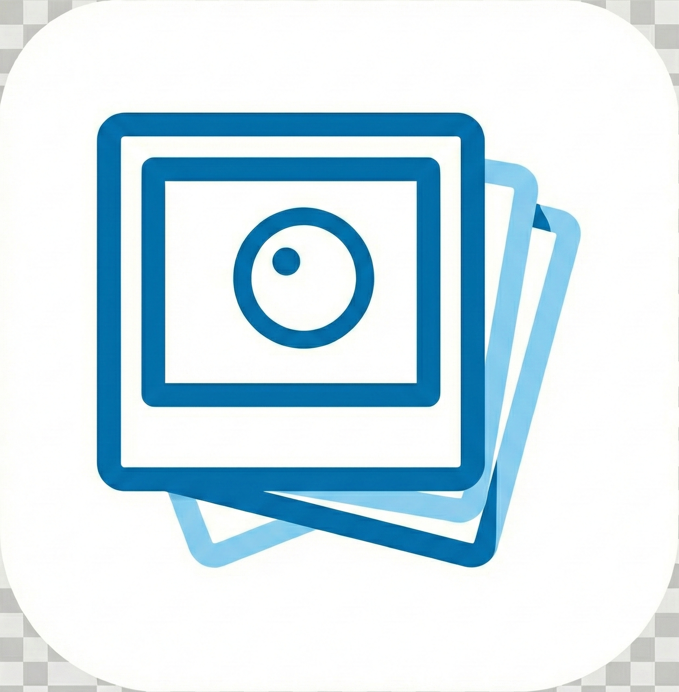

<br/><br/><p align="center">

</p>
<h3 align="center">
Lumina - A serverless photo sync and viewing app
</h3>
<p align="center">
  
</p>
<p align="center">
  <a href="README.md">中文</a> | <a href="README_EN.md">English</a>
</p>

### Introduction

Lumina is a serverless photo sync and viewing app. It uses a Flutter frontend with an embedded Go gRPC server compiled via gomobile (AAR for Android, xcframework for iOS). The server runs on localhost with no external server or database required.

The app is designed to replace the native photo gallery on your phone while providing incremental photo sync to network storage, with a focus on simplicity and great user experience.

### Features

- Local photo browsing
- Cloud photo browsing
- Incremental photo synchronization to the cloud
- Background periodic synchronization
- No database, no server-side dependencies
- Date-based cloud storage directory structure
- Video upload and browsing support
- Places — browse photos on a map, grouped by city (offline geocoding)

### Supported Storage Backends

- [x] Samba (SMB)
- [x] WebDAV
- [x] NFS
- [x] S3-compatible storage (AWS S3, MinIO, Backblaze B2, etc.)
- [ ] OneDrive
- [ ] Google Drive
- [ ] Google Photos

### Installation

[Download APK](https://github.com/zhupengjia/pho/releases)

### Screenshots

<p align="left">

</p>

### Build

```bash
# Install protobuf code generators
make prebuild

# Generate gRPC code from proto definitions (both Go and Dart)
make protobuf

# Build standalone Go server binary
make server

# Build mobile libraries (gomobile)
make server-aar    # Android AAR
make server-ios    # iOS xcframework

# Build apps
make apk           # Android
make ipa           # iOS
```

### Testing

Tests are Go integration tests requiring Docker Compose services (SMB, WebDAV, NFS containers):

```bash
make test                                          # Full: start services, test, teardown
go test -v ./server/api -p 1 -failfast            # API tests only (services must be running)
go test -v ./server/drive -p 1 -failfast           # Drive tests only
docker compose -f test/docker-compose.yml up -d    # Start test services manually
```

### File Storage Logic

Files are stored using a straightforward time-based directory structure, with the original filename preserved. A `.thumbnail` directory is created at the root to store generated thumbnails, mirroring the same directory structure as the source files.

You can access and use your backed-up photos in any other manner at any time, without depending on this app.

Directory structure:
```bash
├── 2022
│   ├── 07
│   │   ├── 02
│   │   │   ├── 20220702_100940.JPG
│   │   │   ├── 20220702_111416.JPG
│   │   │   └── 20220702_111508.JPG
│   │   └── 03
│   │       ├── 20220703_101923.DNG
│   │       ├── 20220703_112336.DNG
│   │       └── 20220703_112338.DNG
├── 2023
│   └── 01
│       └── 03
│           ├── 20230103_112348.JPG
│           ├── 20230103_124634.JPG
│           └── 20230103_124918.DNG
└── .thumbnail
     └── 2022
         └── 07
             ├── 02
             │   ├── 20220702_100940.JPG
             │   ├── 20220702_111416.JPG
             │   └── 20220702_111508.JPG
             └── 03
                 ├── 20220703_101923.DNG
                 ├── 20220703_112336.DNG
                 └── 20220703_112338.DNG
```

### Roadmap

- [x] Support zooming in/out of images
- [x] Support uploading/browsing videos
- [x] Support NFS
- [x] Support S3-compatible storage
- [x] Support iOS
- [ ] Support Desktop
- [x] Support Chinese and English

### Contributing

Feel free to communicate via issues and submit your pull requests.

### Acknowledgments

This project is based on [fregie/pho](https://github.com/fregie/pho). Thanks to [fregie](https://github.com/fregie) for the excellent work and open-source contribution.

### License

[MIT](LICENSE)
